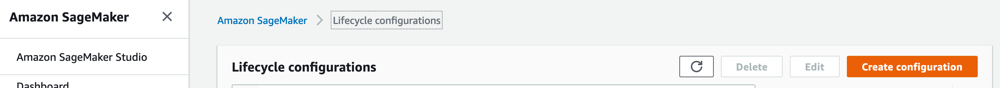
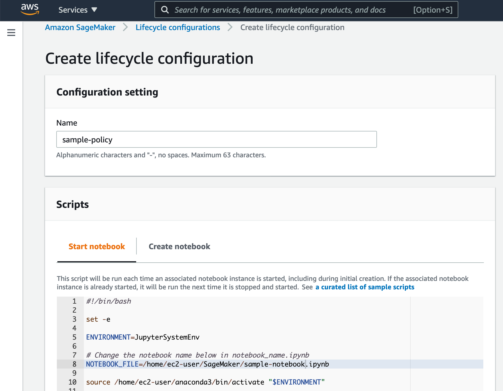
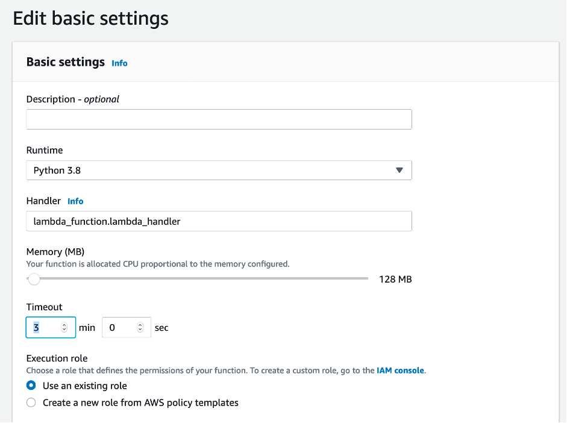
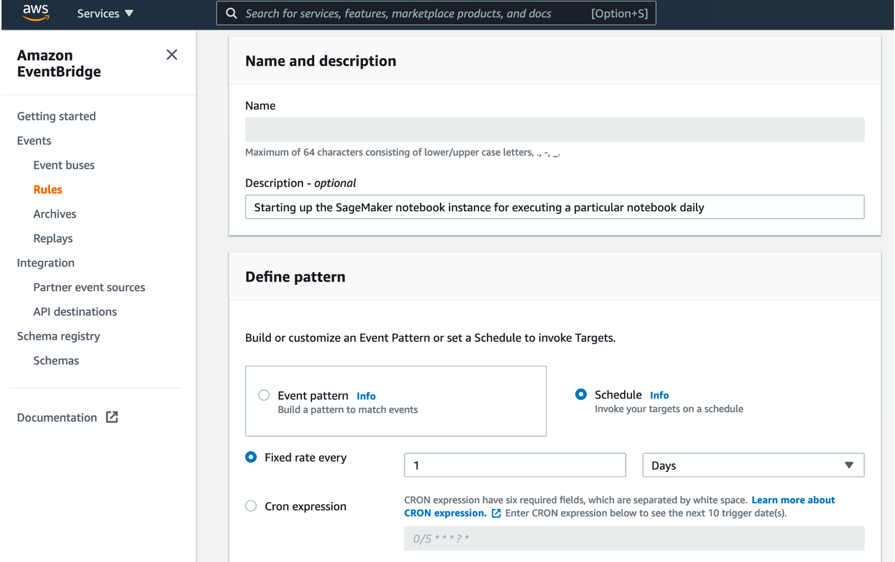
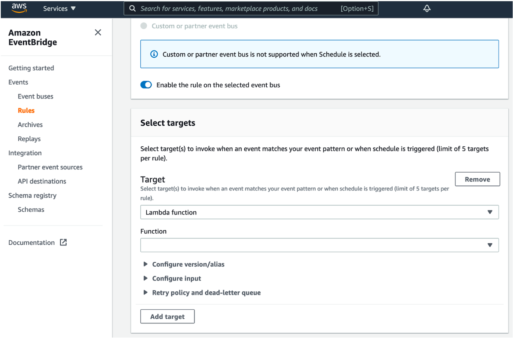
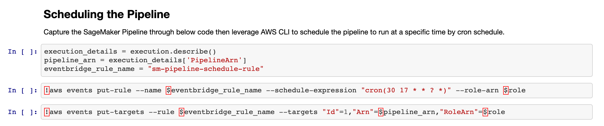

# Orchestrating / Automating Tasks in SageMaker

There are SageMaker Notebook standaline instances and SageMaker Studio available now. While orchestrating tasks within SageMaker had not been easier before SageMaker Pipeline is available. This repository provide samples on both options on automating the executions of whole piece of notebook inside a SageMaker notebook instance, and decoupling SageMaker tasks to be orchestrated by SageMaker Pipeline, scheduled with EventBridge as well inside the notebook.

## Option 1: Automating the Execution of the Notebook inside a SageMaker Notebook Instance

First create a Lifecyle Policy inside SageMaker:

Then paste the script [here](https://github.com/samsonlee0907/sagemaker-tasks-orchestrations/blob/main/sagemaker_lifecycle_policy.sh) to the "Start Notebook" session:

Afterwards, associate the lifecycle policy with teh SageMaker Notebook instance where the targeted notebook is located in.

Next create a Lambda function with Python runtime using the sample code [here](https://github.com/samsonlee0907/sagemaker-tasks-orchestrations/blob/main/lambda_python_start_notebook.py)

The below code block is responsible for starting the SageMaker notebook instance:

`client.start_notebook_instance(NotebookInstanceName=instanceName)`

While to minimize where error may happen due to the SageMaker instance is not in a stopped state, may further implement logic upon reading the status of the notebook instance:

`status = client.describe_notebook_instance(NotebookInstanceName=instanceName).get('NotebookInstanceStatus')`

Since Lambda has a default timeout set to be 3 seconds, in order to keep the Lambda function running for a longer time to monitor the SageMaker notebook instance status, you may need further configure the timeout per below inside the Lambda function:

Finally you may set a schedule to automate the Lambda Function execution by using either CloudWatch event or EventBridge

Creating a schedule for an EventBridge rule:

Define the Lambda function to be triggered:

## Option 2: Scheduleing a SageMaker Pipeline within SageMaker notebook

Referencing from the example notebook [here](https://github.com/aws/amazon-sagemaker-examples/blob/master/sagemaker-pipelines/tabular/abalone_build_train_deploy/sagemaker-pipelines-preprocess-train-evaluate-batch-transform.ipynb), further added a section on how to leverage AWS CLI inside the notebook to schedule the SageMaker Pipeline intuitively:

